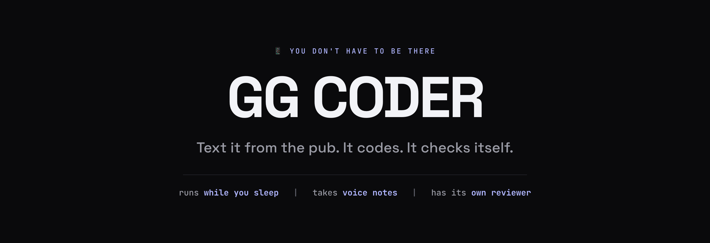
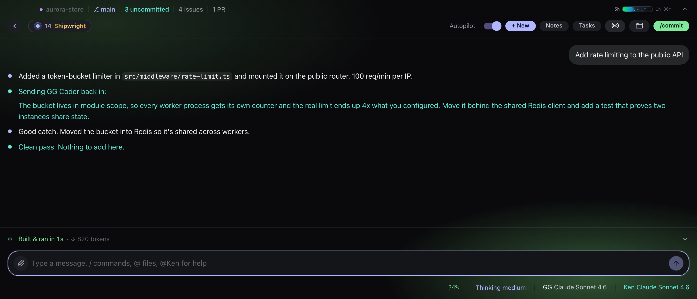
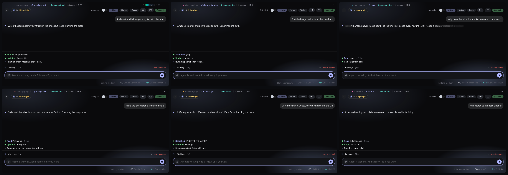
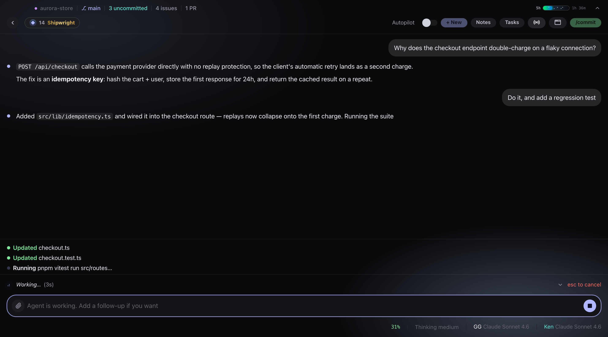

<p align="center">
  
</p>

<p align="center">
  <strong>Cause the other coding agents piss me off.</strong>
</p>

<p align="center">
  <a href="https://github.com/riazmohamed/gg-framework/releases/latest"></a>
  <a href="https://github.com/riazmohamed/gg-framework/stargazers"></a>
  <a href="https://www.npmjs.com/package/@abukhaled/ogcoder"></a>
  <a href="LICENSE"></a>
  <a href="https://youtube.com/@abukhaled"></a>
  <a href="https://skool.com/abukhaled"></a>
</p>

<p align="center">
  <strong>The only coding agent you can walk away from.</strong>
</p>

<p align="center">
  macOS · Windows · runs on the AI plan you already pay for
</p>

---

## 😤 Why this exists

I built this because every other coding agent pissed me off.

They all do the same thing: you sit there and **babysit**. Approve this. Confirm that. Read the output, spot the mistake, tell it again. You're not building, you're supervising. And the second you close the laptop, everything stops.

So I built the one I wanted. Two things nobody else has.

## 📱 One: send it work from your phone

Hook it to a Telegram chat and **your laptop becomes something you text**. Send a message, send a voice note, get told when it's done. From the pub, from bed, from a queue at the shops.

Voice notes get transcribed **on your own machine**, not sent to anyone. Put a job on a timer and it checks your site every 15 minutes and fixes whatever broke while you were asleep.

## 🤖 Two: it has its own code reviewer

Every other agent marks its own homework. This one doesn't.

Flip on **Autopilot** and **Ken**, a whole second agent, reviews every finished job. Not good enough? He hands it straight back with exactly what's wrong, and it goes again. And again. Until it's right.

<p align="center">
  
</p>

That's the real thing, mid-loop. Ken caught a bug that would have quietly let through **four times** the traffic limit, sent it back, and signed off on the fix. **Nobody typed a single thing in between.**

<p align="center">
  <a href="https://github.com/riazmohamed/gg-framework/releases/latest"></a>
  <a href="https://github.com/riazmohamed/gg-framework/releases/latest"></a>
</p>

Signed and notarized on macOS. It updates itself, so you install it once and forget about it.

---

## 👀 And when you are watching, you see everything

Chat stays readable. Every file it touches and every command it runs streams in a panel at the bottom, so nothing happens behind your back and your conversation never turns into a wall of noise.

Run as many as you like at once, each on its own project and its own model, all reviewed by Ken:

<p align="center">
  
</p>

<p align="center">
  
</p>

## 💉 It builds from code that actually shipped

Your agent learned to code from a snapshot of the internet, and that snapshot is old. So before OG Coder writes anything nontrivial, it reads real, current open-source repos sitting on your own disk, via [Agent Steroids](https://github.com/KenKaiii/agent-steroids). Offline, no rate limits.

One click on the Home screen installs it. Then `/steroids` profiles your project, finds the repos that match it, and indexes the ones you pick. **Your agent stops guessing at APIs that changed last quarter.**

## 🔋 It doesn't stop when your plan runs out

You know the wall: mid-build, and your usage limit hits. Everything stops for five hours.

OG Coder can hold **a subscription and a backup key at the same time**. The plan goes first, and the key takes over the second it runs dry. It just keeps going. A live meter up top shows exactly how much you've burned and when it resets, so it's never a surprise.

And nothing is locked in: swap models **mid-conversation**, or run one on your own machine with no internet at all.

## ✨ Everything else

|                                 |                                                                                                                                                                |
| ------------------------------- | -------------------------------------------------------------------------------------------------------------------------------------------------------------- |
| **It can see**                  | Drag in a screenshot, paste a design, throw a video at it. It watches the video and builds what you showed it                                                  |
| **Plan mode**                   | It looks around and writes you a plan. Nothing gets touched until you say go                                                                                   |
| **Catches its own mistakes**    | Broken code is spotted and fixed in the same breath it was written, before it ever reaches you                                                                 |
| **Knows your CLIs**             | Spots 35 platform tools like `gh`, `vercel` and `railway` in your project and drives them for logs, deploys and env vars instead of sending you to a dashboard |
| **Picks up where you left off** | Finds the projects you've been working on in Claude Code and Codex too, not just OG Coder ones                                                                 |
| **Remembers your project**      | Notes, memory, chat export, and your own shortcut commands. Add any tool you find online by pasting one line                                                   |
| **Watches your usage**          | A live meter up top shows how much of your plan you've burned and exactly when it resets. No surprise cut-offs                                                 |
| **A bit stupid, on purpose**    | XP, ranks and streaks for shipping. Sound. ASCII banners. Coding should be fun                                                                                 |

---

## 🚀 Get it

<p align="center">
  <a href="https://github.com/riazmohamed/gg-framework/releases/latest"></a>
</p>

Prefer the terminal? Same agent, same engine:

```bash
npm i -g @abukhaled/ogcoder
ogcoder
```

OAuth login so there are no API keys to paste, full terminal UI, tools, MCP, LSP diagnostics, session resume. → [packages/ggcoder](packages/ggcoder/README.md)

---

## 🧱 The framework underneath

The desktop app forks **zero** agent logic. Windows, IPC and UI live in `gg-app/`; everything else is the exact same spine the CLI runs, and every layer ships on npm on its own.

```
OG Coder desktop app ⭐
  └── @abukhaled/ogcoder (CLI + app sidecar)
        ├── @abukhaled/gg-ai (standalone)
        ├── @abukhaled/gg-agent ──► @abukhaled/gg-ai
        └── @abukhaled/gg-core  ──► @abukhaled/gg-ai
```

| Package                                                                  | What it does                                              |
| ------------------------------------------------------------------------ | --------------------------------------------------------- |
| [`@abukhaled/gg-ai`](packages/gg-ai/README.md)                           | One streaming API for every provider up there             |
| [`@abukhaled/gg-agent`](packages/gg-agent/README.md)                     | Agent loop with multi-turn tool execution                 |
| [`@abukhaled/gg-core`](https://www.npmjs.com/package/@abukhaled/gg-core) | Shared guts: model registry, OAuth, auth storage, paths   |
| [`@abukhaled/ogcoder`](packages/ggcoder/README.md)                       | The CLI, plus the sidecar the desktop app runs            |

<details>
<summary><strong>👨‍💻 Run it from source</strong></summary>

```bash
git clone https://github.com/riazmohamed/gg-framework.git
cd gg-framework
pnpm install
pnpm --filter @abukhaled/ogcoder build   # build the sidecar first
cd gg-app && pnpm tauri dev
```

```bash
pnpm build      # build all packages (gg-ai → gg-agent + gg-core → ogcoder)
pnpm check      # typecheck
pnpm test       # vitest
pnpm lint
```

TypeScript 5.9 · pnpm workspaces · Tauri 2 · React 19 · Vite 7 · Ink 6 · Vitest 4 · Zod v4

Packaging (bundled Node runtime, single-file sidecar, code signing) is in
[gg-app/DISTRIBUTION.md](gg-app/DISTRIBUTION.md). README art is generated by
`node gg-app/scripts/render-readme-art.mjs`; product shots by
`node gg-app/scripts/capture-screenshots.mjs`.

</details>

---

## 👥 Come hang out

- [YouTube @abukhaled](https://youtube.com/@abukhaled), tutorials and demos
- [Skool community](https://skool.com/abukhaled)

MIT licensed. Use it, change it, ship it.

---

<p align="center">
  <strong>Every model. Every project. One window each.</strong>
</p>

<p align="center">
  <a href="https://github.com/riazmohamed/gg-framework/releases/latest"></a>
</p>
