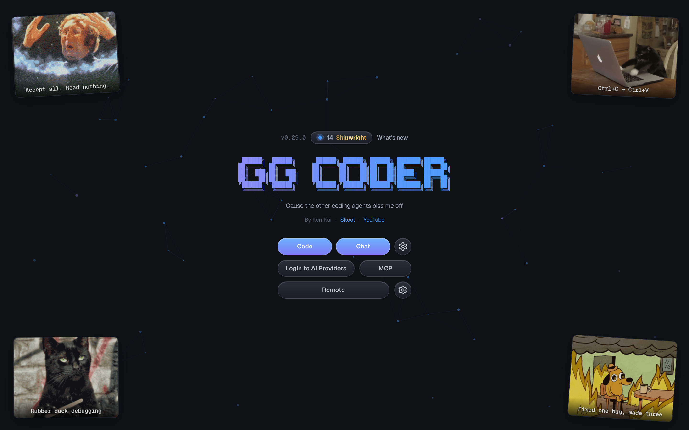
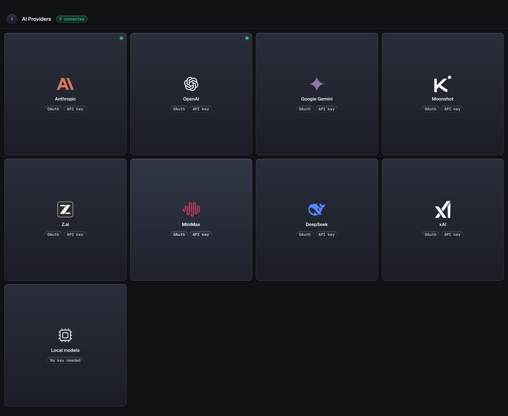
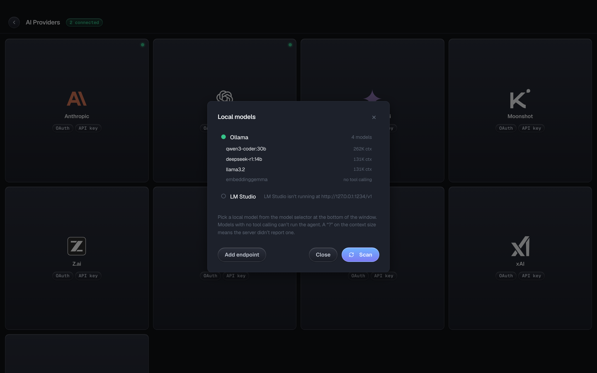

# OG Coder

<p align="center">
  <strong>Cause the other coding agents piss me off.</strong>
</p>

<p align="center">
  <a href="https://github.com/riazmohamed/gg-framework/releases/latest"></a>
  <a href="https://www.npmjs.com/package/@abukhaled/ogcoder"></a>
  <a href="LICENSE"></a>
  <a href="https://youtube.com/@abukhaled"></a>
  <a href="https://skool.com/abukhaled"></a>
</p>

---

# ⭐ OG Coder, the desktop app

**This is the main thing.** A real desktop app, not a chat box with a code theme. Every
window is its own agent, pointed at its own project folder, running real tools on your
machine.

<p align="center">
  <a href="https://github.com/riazmohamed/gg-framework/releases/latest"></a>
  <a href="https://github.com/riazmohamed/gg-framework/releases/latest"></a>
</p>

Signed and notarized on macOS. It updates itself, so you install it once and forget about it.

## As many projects as you want, all going at once

Yeah, you can split a terminal into panes. That's where this workflow came from. The
difference is this is **actual software** now: real OS windows you can move between
desktops, tile with one click, full-screen individually, and pick up with your mouse.

Open OG Coder on your side project in one window, your client's Next.js app in another, a
Rust thing in a third, a landing page in a fourth. Each window runs its **own** agent, its
own folder, its own model, its own history. Nothing bleeds between them.

<p align="center">
  
</p>

Six projects, six different models (Claude, Codex, a local qwen3-coder, Gemini, Kimi, GLM),
all going at the same time. And six isn't the ceiling either. Tile 2, 4, 6, or hit
auto-arrange and it lays out however many you've got open.

### It stays light

The whole shell is **Rust**. No Electron, no bundled browser engine sitting in RAM per
window. It uses the renderer your OS already ships, and each window's agent only costs you
something while it's actually running. Six windows open is a normal Tuesday, not a fan
event.

<p align="center">
  
</p>

## Everything else it does

### It finds the projects you're already working on

Not just OG Coder ones. It digs up everything you've touched in **Claude Code and Codex**
too. Pick one, keep going.

<p align="center">
  
</p>

### You can actually see what it's doing

Chat stays readable. Tools stream in a pinned panel at the bottom, so you see every file
it touches and every command it runs without your conversation turning into a wall of
JSON. Git branch, uncommitted count, open issues and PRs up top. Context %, thinking
level and both models down bottom.

<p align="center">
  
</p>

### Use whatever model you want

Anthropic, OpenAI/Codex, Gemini, Kimi, GLM, MiniMax, DeepSeek, Xiaomi MiMo, xAI,
OpenRouter. OAuth or API key, your call. Kimi and Grok take both at once — your
subscription goes first and the API key covers you automatically when plan usage runs
out. Swap models mid-conversation, nobody's stopping you.

<p align="center">
  
</p>

### Including the ones running on your own machine

Ollama, LM Studio, llama.cpp and vLLM get found automatically on their normal ports. No
config, no flags. Real context windows and capabilities come from the server itself, so a
model that can't call tools gets flagged right here instead of blowing up on your first
prompt.

<p align="center">
  
</p>

### Autopilot, the one nobody knows about

Flip Autopilot on and Ken (a mentor agent) reviews every finished run. If the work's not
good enough he sends OG Coder straight back in with specific feedback, and it keeps going
until he signs off. You go make coffee.

<p align="center">
  
</p>

Real loop above: it built a rate limiter, Ken caught that the bucket was per-process and
sent it back, it moved the thing into Redis and added a test, Ken signed off. Nobody
typed anything in between.

### It can see

Drag in a screenshot. Paste a design. Throw a video at it. Video goes straight to the
models that handle it (Gemini 3.x, Kimi K3, MiniMax M3, MiMo-V2.5). For the ones that
don't, the agent gets the file and reaches for ffmpeg itself.

### Plan mode

Read-only poking around first, a written plan you approve, then it goes. For the stuff you
really don't want it improvising on.

### It catches its own type errors

Every edit gets checked by a real language server. TypeScript ships in the box, zero
setup, so type errors get caught and fixed in the same turn it created them. Python, Go,
Rust and C/C++ kick in if their toolchain is on your PATH.

### MCP, subagents, memory, the works

Paste any `claude mcp add …` line and it just works. Spawn subagents for parallel work.
Project memory, notes, chat export, prompt enhancement, your own slash commands in
`.gg/commands/*.md`.

### It watches your quota

Live usage meter in the title bar. How much of your 5-hour and weekly window you've
burned, and when it resets. No more surprise rate limits.

### And it's a bit stupid, on purpose

XP, ranks and streaks for shipping. Sound. ASCII banners. Webcam gaze focus if you want
your eyeballs to switch windows for you.

## Run it from source

```bash
git clone https://github.com/riazmohamed/gg-framework.git
cd gg-framework
pnpm install
pnpm --filter @abukhaled/ogcoder build   # build the sidecar first
cd gg-app && pnpm tauri dev
```

Packaging stuff (bundled Node runtime, single-file sidecar, code signing) is in
[gg-app/DISTRIBUTION.md](gg-app/DISTRIBUTION.md).

---

# ⌨️ The CLI

Same agent, in your terminal. The app is the face, this is the engine.

```bash
npm i -g @abukhaled/ogcoder
ogcoder
```

OAuth login so there's no API keys to paste, full terminal UI, tools, MCP, LSP
diagnostics, session resume. → [packages/ggcoder](packages/ggcoder/README.md)

---

# 🧱 The framework underneath

Every layer ships on its own. Take one, take all of them.

| Package                                                                    | What it does                                            | README                                           |
| -------------------------------------------------------------------------- | ------------------------------------------------------- | ------------------------------------------------ |
| [`@abukhaled/gg-ai`](https://www.npmjs.com/package/@abukhaled/gg-ai)       | One streaming API for every provider up there           | [packages/gg-ai](packages/gg-ai/README.md)       |
| [`@abukhaled/gg-agent`](https://www.npmjs.com/package/@abukhaled/gg-agent) | Agent loop with multi-turn tool execution               | [packages/gg-agent](packages/gg-agent/README.md) |
| [`@abukhaled/gg-core`](https://www.npmjs.com/package/@abukhaled/gg-core)   | Shared guts: model registry, OAuth, auth storage, paths | [packages/gg-core](packages/gg-core/README.md)   |
| [`@abukhaled/ogcoder`](https://www.npmjs.com/package/@abukhaled/ogcoder)   | The CLI, plus the sidecar the desktop app runs          | [packages/ggcoder](packages/ggcoder/README.md)   |
| [`@kenkaiiii/gg-boss`](https://www.npmjs.com/package/@kenkaiiii/gg-boss)   | Drives a bunch of workers across projects from one chat | [packages/gg-boss](packages/gg-boss/README.md)   |

```
@abukhaled/gg-ai (standalone)
  └─► @abukhaled/gg-agent
        └─► @abukhaled/gg-core
              ├─► @abukhaled/ogcoder ──► OG Coder desktop app ⭐
              └─► @kenkaiiii/gg-boss
```

The desktop app forks **zero** agent logic. Windows, IPC and UI live in `gg-app/`.
Everything else is the exact same spine the CLI runs.

## What do I actually need?

| You want to...                                           | Use                                                                               |
| -------------------------------------------------------- | --------------------------------------------------------------------------------- |
| Code with a real UI, across as many projects as you want | **[Download OG Coder](https://github.com/riazmohamed/gg-framework/releases/latest)** |
| Code in your terminal                                    | `npm i -g @abukhaled/ogcoder`                                                     |
| Run a bunch of agents across projects from one chat      | `npm i -g @kenkaiiii/gg-boss`                                                     |
| Build your own agent that calls tools and loops          | `npm i @abukhaled/gg-agent`                                                       |
| Stream from any LLM provider with one API                | `npm i @abukhaled/gg-ai`                                                          |

---

## For devs

```bash
pnpm install
pnpm build      # tsc across all packages
pnpm check      # typecheck
pnpm test       # vitest
```

TypeScript 5.9 · pnpm workspaces · Tauri 2 · React 19 · Vite 7 · Ink 6 · Vitest 4 · Zod v4

---

## Come hang out

- [YouTube @abukhaled](https://youtube.com/@abukhaled) for tutorials and demos
- [Skool community](https://skool.com/abukhaled)

---

## License

MIT

---

<p align="center">
  <strong>Less bloat. More coding. Every model. Every project. One window each.<br>
  Rust under the hood, so it stays out of your way.</strong>
</p>

<p align="center">
  <a href="https://github.com/riazmohamed/gg-framework/releases/latest"></a>
  <a href="https://www.npmjs.com/package/@abukhaled/ogcoder"></a>
</p>
