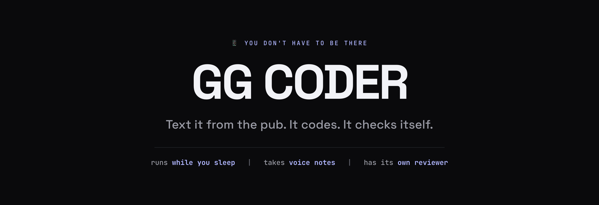

<p align="center">
  
</p>

<p align="center">
  <strong>Cause the other agents piss me off.</strong>
</p>

<p align="center">
  <a href="https://github.com/riazmohamed/gg-framework/releases/latest"></a>
  <a href="https://github.com/riazmohamed/gg-framework/stargazers"></a>
  <a href="https://www.npmjs.com/package/@abukhaled/ogcoder"></a>
  <a href="LICENSE"></a>
  <a href="https://youtube.com/@abukhaled"></a>
  <a href="https://skool.com/abukhaled"></a>
</p>

OG Coder is a desktop AI app that helps you write code, chat, and make videos. Ken Autopilot checks the coding work, chat remembers context, and GG Motion creates videos from your ideas. Pick your AI provider, open as many windows as you need, and tell it what you want to do. Less babysitting, more getting things done.

## Get started

1. Install OG Coder:

   **macOS (Apple Silicon):** [Download the latest release](https://github.com/riazmohamed/gg-framework/releases/latest) and open the `.dmg`.

   **Windows:** [Download the latest release](https://github.com/riazmohamed/gg-framework/releases/latest) and run the `.exe` installer.

   **Development:** With Node.js, pnpm, and the [Tauri prerequisites](https://v2.tauri.app/start/prerequisites/) installed:

   ```bash
   git clone https://github.com/riazmohamed/gg-framework.git
   cd gg-framework
   pnpm install
   pnpm build
   pnpm --filter gg-app tauri dev
   ```

2. Open the app, connect your AI provider, and pick Code, Chat, or Motion.

## Build with the framework

Want the engine without the desktop app? Use the same packages in your own apps. Install just what you need.

- [**@abukhaled/gg-ai**](packages/gg-ai/README.md): Connect to AI providers and stream responses.
- [**@abukhaled/gg-agent**](packages/gg-agent/README.md): Build agents that use your tools and work through tasks.
- [**@abukhaled/gg-core**](packages/gg-core/README.md): Model selection, authentication, and local model discovery.
- [**@abukhaled/ogcoder**](packages/ggcoder/README.md): The coding agent, sessions, and tools behind the app and CLI.

For your own agent, start here:

```bash
npm install @abukhaled/gg-ai @abukhaled/gg-agent
```

The package links above cover setup and usage. MIT licensed, so you can build on it.

## Learn with me

Come build with me in my [Skool community](https://skool.com/abukhaled). Get help, share what you're making, and learn how to get more out of AI.
