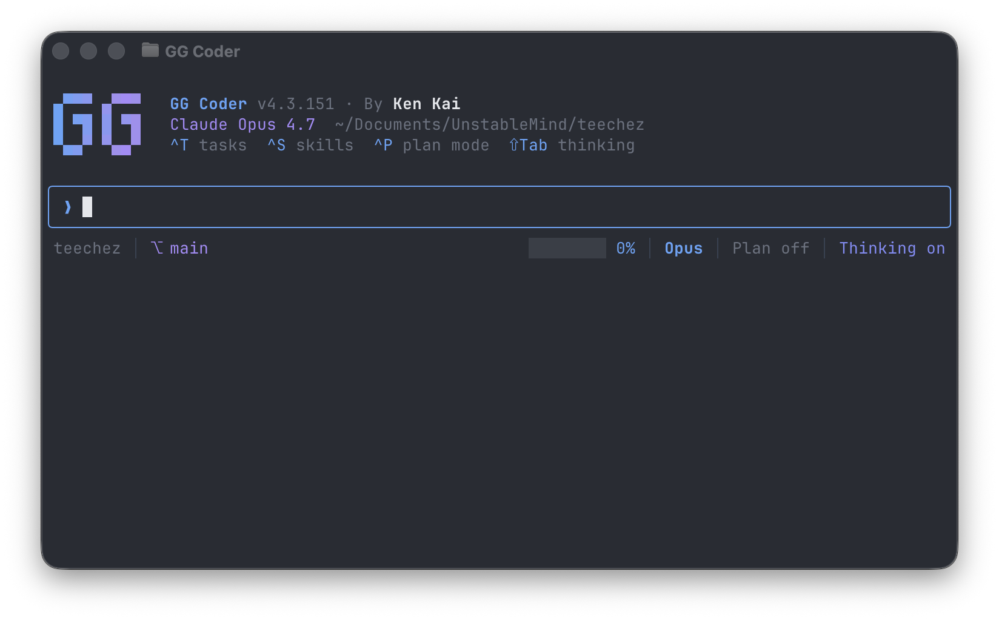

# @abukhaled/ogcoder



<p align="center">
  <strong>The fast, lean coding agent. Twelve providers plus local models. Zero bloat.</strong>
</p>

<p align="center">
  <a href="https://www.npmjs.com/package/@abukhaled/ogcoder"></a>
  <a href="../../LICENSE"></a>
  <a href="https://youtube.com/@abukhaled"></a>
  <a href="https://skool.com/abukhaled"></a>
  <a href="https://github.com/KenKaiii"></a>
</p>

A coding agent that ships only what the model needs to work — a tiny system prompt, no bundled MCPs, and a focused tool set. Switch between Anthropic, OpenAI, Gemini, xAI, Moonshot, GLM, MiniMax, Xiaomi, DeepSeek, Sakana, OpenRouter, Hugging Face, and your own local models mid-conversation. Run it in the terminal, or use the same engine in the [OG Coder desktop app](../../README.md).

Built on [`@abukhaled/gg-ai`](../gg-ai/README.md), [`@abukhaled/gg-agent`](../gg-agent/README.md), and `@abukhaled/gg-core`. Part of the [GG Framework](../../README.md) monorepo.

---

## Run It

```bash
npm i -g @abukhaled/ogcoder

ogcoder login    # Pick provider, authenticate
ogcoder          # Start coding
```

OAuth for Anthropic, OpenAI, and Gemini; OAuth or an API key for xAI and Moonshot (log in once, auto-refresh, no key to leak). API keys for the rest. Up and running in seconds either way. Auth lives in `~/.gg/auth.json` and is shared with the OG Coder desktop app.

---

## The system prompt problem

Every token in the system prompt gets processed on **every single turn**. It's not a one-time cost. It's a tax on every request.

|                    | **Claude Code / Agent SDK** | **OG Coder**      |
| ------------------ | --------------------------- | ----------------- |
| System prompt size | ~15,000 tokens              | **~1,100 tokens** |
| Ratio              | baseline                    | **~13x smaller**  |

### Why you should care

- **Slower responses.** More input tokens = longer time-to-first-token. In a 30-turn session, that wait adds up to minutes.
- **Worse instruction following.** More rules = more things the model ignores. "Lost in the middle" is well-documented. A 1,100 token prompt gets read. A 15,000 token one gets skimmed.
- **Context fills up faster.** ~15,000 tokens sitting in your window permanently. That's ~7.5% of a 200K model gone before you say hello. You hit compaction sooner, lose history faster, and the agent forgets what it was doing.
- **Higher cost.** Input tokens aren't free. Every cache miss charges you for the full bloat. Smaller prompt = smaller bill.

OG Coder sends only what the model needs: how to work, what tools it has, and your project context. No walls of rules. No formatting instructions. Just signal.

---

## The MCP problem

Same philosophy applies to tools. People collect MCPs like Pokemon. Slack MCP, GitHub MCP, Notion MCP, five different file system MCPs. Every single one injects its tool descriptions into the context. The model now has to figure out which of 40+ tools to use for any given task.

This doesn't help. It confuses the agent. More tool descriptions = more noise = worse tool selection. The model spends tokens reasoning about tools it will never call.

OG Coder ships with no MCPs by default. Checking work against real-world code is a native tool instead: `steroids` finds production repos similar to yours so the agent can confirm API usage, library idioms, and patterns. It loads only when the agent asks for it, so it costs nothing until it's used. (On GLM, the Z.AI MCP servers that come with your key are connected automatically.)

You can still add your own MCPs in `~/.gg/mcp.json` or `.gg/mcp.json`. But start with less. You'll get better results.

---

## Twelve providers, one agent

Switch mid-conversation with `/model`. Not locked to anyone.

| Provider          | Models                                                                                      | Auth             |
| ----------------- | ------------------------------------------------------------------------------------------- | ---------------- |
| **Anthropic**     | Claude Fable 5.1, Opus 5.5, Sonnet 5.5, Haiku 5.5                                           | OAuth            |
| **OpenAI**        | GPT-6 Astra, GPT-6.1 Sol, GPT-6 Luna                                                        | OAuth            |
| **Gemini**        | Gemini 3.1 Pro (Preview), 3.8 Flash, 3.7 Flash, 3.5 Flash, 3.5 Flash Lite, 3.1 Flash Lite   | OAuth            |
| **xAI (Grok)**    | Grok 4.7                                                                                    | OAuth or API key |
| **Moonshot**      | Kimi K3, K2.8 Preview (Kimi sign-in), K2.7 Code, K2.7 Code HighSpeed                        | OAuth or API key |
| **Z.AI (GLM)**    | GLM-5.3, GLM-5.3-Flash                                                                      | API key          |
| **MiniMax**       | MiniMax M3                                                                                  | API key          |
| **Xiaomi (MiMo)** | MiMo-V2.6-Pro, MiMo-V2.6-Flash, MiMo-V2.6-Pro-UltraSpeed                                    | API key          |
| **DeepSeek**      | DeepSeek V4 Pro, V4.1 Flash                                                                 | API key          |
| **Sakana (Fugu)** | Fugu, Fugu Max, Fugu Ultra                                                                  | API key          |
| **OpenRouter**    | Qwen3.8 Max                                                                                 | API key          |
| **Hugging Face**  | Kimi K2.7 Code, DeepSeek V4.1 Flash, GPT-OSS 120B (Inference Providers router)              | API key          |
| **Local**         | Any model on an OpenAI-compatible server: Ollama, LM Studio, llama.cpp, vLLM                | None             |

Every hosted model above except GLM-5.3, DeepSeek V4 Pro, and GPT-OSS 120B accepts images.

The same conversation, the same tools, the same project context — only the model changes. Use a strong reasoning model when you need it, swap to a fast cheap one for grunt work, never restart your session.

**Attachments.** Drag, paste, or type a path to attach images and video in the chat input. Video is sent natively to models that support it (Gemini 3.x, every Moonshot Kimi model, MiniMax M3, MiMo-V2.6, Qwen3.8 Max); for other models the video is saved to a temp file and the model is told to inspect it with ffmpeg or its own tools.

---

## Keybindings

| Key                         | What it does                                                     |
| --------------------------- | ---------------------------------------------------------------- |
| <kbd>Ctrl+T</kbd>           | Open the Task pane                                               |
| <kbd>Ctrl+S</kbd>           | Open the Skills pane                                             |
| <kbd>Shift+Tab</kbd>        | Cycle extended thinking (off / low / medium / high / max)        |
| <kbd>Esc</kbd>              | Interrupt the agent mid-turn                                     |
| <kbd>Ctrl+C</kbd> ×2        | Exit                                                             |
| <kbd>↑</kbd> / <kbd>↓</kbd> | Recall previous prompts (when input is empty)                    |
| <kbd>Enter</kbd>            | Send · <kbd>Shift+Enter</kbd> newline · `/` opens the slash menu |

---

## Slash commands

Everything runs through slash commands inside the session. Not CLI flags.

| Command                 | What it does                                               |
| ----------------------- | ---------------------------------------------------------- |
| `/model` (`/m`)         | Switch model on the fly                                    |
| `/compact` (`/c`)       | Compress context when it gets long                         |
| `/new` (`/n`)           | Start a fresh session in this project                      |
| `/session` (`/s`)       | Resume a prior session                                     |
| `/branch` (`/b`)        | Branch the current conversation                            |
| `/branches`             | List branches of the current session                       |
| `/rewind`               | Restore files and/or conversation to an earlier checkpoint |
| `/add-dir`              | Add another project folder to this workspace               |
| `/remove-dir`           | Remove an added project folder from this workspace         |
| `/settings` (`/config`) | Open settings                                              |
| `/help` (`/h`, `/?`)    | Show all commands                                          |
| `/quit` (`/q`, `/exit`) | Exit                                                       |

Plus built-in workflows that ship with the binary:

```bash
/expand        # Find exciting new features to add
/init          # Generate or update AGENTS.md / CLAUDE.md for your project
/setup-commit  # Generate a /commit command with quality checks
/setup-ci      # Set up or harden CI for any stack
/setup-skills  # Audit and recommend reusable skills
/compare       # Compare your code against real-world code
/steroids      # Index real repos like this project
```

---

## Tools

OG Coder comes with a focused set of tools. Only six core tools — `read`, `write`, `edit`, `bash`, `grep`, and `skill` — plus `tool_search` send their full schemas on every request. Everything else is listed as a one-line hint and loads the first time the agent needs it, so rarely used tools cost almost nothing.

| Tool                              | What it does                                                                                           |
| --------------------------------- | ------------------------------------------------------------------------------------------------------ |
| `bash`                            | Run shell commands, in the foreground or background (`task_output` / `task_send` / `task_stop`)        |
| `read`                            | Read file contents                                                                                     |
| `write`                           | Write files                                                                                            |
| `edit`                            | Surgical string replacements                                                                           |
| `grep`                            | Search file contents (regex)                                                                           |
| `skill`                           | Load a skill's instructions                                                                            |
| `tool_search`                     | Load an on-demand tool by capability                                                                   |
| `find` / `ls`                     | Find files by glob pattern / list a directory                                                          |
| `code_search` / `code_nav`        | Find code by meaning / jump to exact definitions and callers                                           |
| `web_fetch` / `web_search`        | Fetch a URL / search the web                                                                           |
| `steroids`                        | Find real production repos similar to yours and read how they do it                                    |
| `source_path`                     | Locate an installed dependency's source                                                                |
| `screenshot`                      | Open a URL / dev server in a headless browser and capture a PNG so the agent can see the rendered page |
| `debug`                           | Drive the Node debugger                                                                                |
| `enter_plan` / `exit_plan`        | Plan before editing, then hand the plan back for approval                                              |
| `subagent`                        | Run one blocking, isolated child task (backward-compatible)                                            |
| `spawn_agent` / `wait_agent`      | Launch persistent child turns concurrently and collect results                                         |
| `send_message` / `followup_task`  | Steer a running child or reuse an idle child's context                                                 |
| `list_agents` / `interrupt_agent` | Inspect or interrupt persistent children                                                               |

The `screenshot` tool needs the optional `playwright` dependency plus a one-time `npx playwright install chromium`. Without it the tool returns an install hint instead of failing the turn. Captured images render inline in graphics-capable terminals (kitty, Ghostty, WezTerm, iTerm2); other terminals show a text line.

Add your own MCPs in `~/.gg/mcp.json` or `.gg/mcp.json` if you need more — but start lean.

### Async subagent lifecycle

`subagent` remains blocking. The async suite launches persistent NDJSON worker processes, so a parent can start up to four active child turns, keep working, steer them, and wait for any or all results. Up to eight idle workers remain available for follow-up; bounded snapshots retain the latest 20 agents.

Only GPT-6 Astra and GPT-6.1 Sol at **Ultra** delegate proactively. Lower Astra/Sol levels use async agents only when the user or project/skill instructions request delegation; other models receive no proactive policy.

Children share the parent working directory, not isolated worktrees. Parallel writes must target disjoint files or subsystems. Async fan-out is one level deep, child output is bounded, idle workers reap after 10 minutes, and workers are not resumable after a CLI/app restart.

Parent cancellation interrupts active children. Session disposal shuts down every worker process alongside background commands, LSP servers, and MCP connections.

---

## Custom commands

Drop a markdown file in `.gg/commands/` and it becomes a slash command. Your React app gets `/deploy` and `/storybook`. Your API gets `/migrate` and `/seed`. Different projects, different commands.

---

## Checkpoints & `/rewind`

Before every file the agent writes or edits, OG Coder snapshots the prior on-disk content into a per-session checkpoint (stored under `~/.gg/checkpoints/`, never in your repo). Run `/rewind` to pick an earlier checkpoint and restore **code only**, **conversation only**, or **both**.

Only edits made through ggcoder's `write`/`edit` tools are tracked — changes made by `bash` (e.g. `sed`, `rm`, codegen) are **not** captured.

---

## Skills

Reusable behaviors across projects. Drop `.md` files in:

- `~/.gg/skills/` for global skills (available everywhere)
- `.gg/skills/` for project-specific skills

They get loaded into the system prompt automatically. The agent knows what it can do without you explaining it each session. <kbd>Ctrl+S</kbd> opens a pane to browse and toggle them.

Eleven ship built in, and route themselves when the work matches:

| Skill              | Fires on                                                                                                                                                                                                                                                                                                                            |
| ------------------ | ----------------------------------------------------------------------------------------------------------------------------------------------------------------------------------------------------------------------------------------------------------------------------------------------------------------------------------- |
| `bulletproof`      | Code an attacker will reach — auth, untrusted input, secrets, dependencies, CI/release, agent/MCP tool surfaces — and "is this safe to ship" reviews. Works on any target: web, API, CLI, desktop, mobile, embedded, contracts, ML.                                                                                                 |
| `clarify`          | Requirements or a design genuinely unsettled — interrogating or stress-testing a plan before building, or a mid-build decision that materially changes the result.                                                                                                                                                                  |
| `code-review`      | Reviewing written work — a diff, PR, or branch — on both what was asked for and how well it is built.                                                                                                                                                                                                                               |
| `compliance-guard` | Legal exposure — personal data, payments, UGC, email/SMS, minors, or a licensed/regulated feature.                                                                                                                                                                                                                                  |
| `durable`          | User data must not be lost — first database/table, migrations, backfills/imports, destructive operations, backups and recovery; any store (Postgres, MySQL, SQLite, Mongo, serverless).                                                                                                                                             |
| `evidence-led-ui`  | Broad or design-sensitive UI work — new screens, redesigns, design systems, accessibility passes.                                                                                                                                                                                                                                   |
| `lean`             | Speed and resource efficiency — slow loading/startup, jank, high CPU, memory leaks and hogging, zombie/orphan processes, bundle bloat, dead code/styles, Core Web Vitals; while building anything that should stay fast, or a perf pass on an existing project. Any stack: web, backend, Electron, Tauri, mobile, native, game, ML. |
| `refactoring`      | Restructuring existing code without changing behavior — "refactor", "clean up", "reduce tech debt", "modernize" or migrate legacy code; test-guarded steps, revert-on-red, characterization tests for untested code.                                                                                                                |
| `root-cause`       | A bug that resists the obvious fix, makes no sense, or keeps coming back — gated diagnosis from red repro to ranked hypotheses to regression test.                                                                                                                                                                                  |
| `shared-language`  | Fuzzy or drifting domain vocabulary, recurring naming decisions, and hard-to-reverse decisions worth recording (glossary + decision records).                                                                                                                                                                                       |
| `tdd`              | Test-driven development — red-green-refactor with pre-agreed seams, when the user asks for test-first work.                                                                                                                                                                                                                         |

---

## Project guidelines

Drop an `AGENTS.md` or `CLAUDE.md` in your repo root (or any parent directory). OG Coder picks it up automatically. One file per directory is loaded, first match wins: `AGENTS.override.md` > `AGENTS.md` > `CLAUDE.md` > `.cursorrules` > `CONVENTIONS.md`.

Your rules. Your conventions. The agent follows them.

---

## Community

- [YouTube @kenkaidoesai](https://youtube.com/@kenkaidoesai) — tutorials and demos
- [Skool community](https://skool.com/kenkai) — come hang out
- [GitHub @KenKaiii](https://github.com/KenKaiii)

---

## License

MIT

---

<p align="center">
  <strong>Lean prompt. Sharp tools. Real results.</strong>
</p>

<p align="center">
  <a href="https://www.npmjs.com/package/@abukhaled/ogcoder"></a>
</p>
